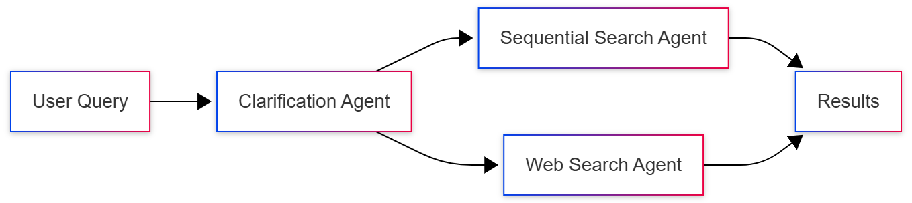
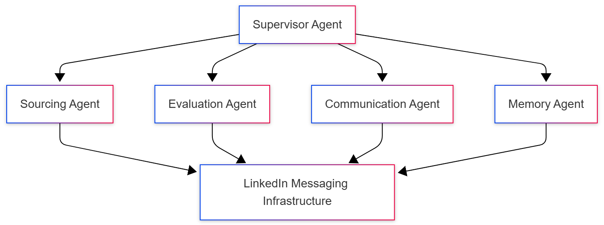
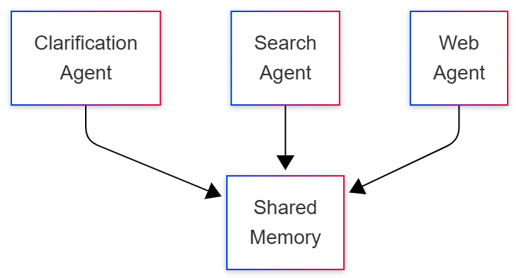
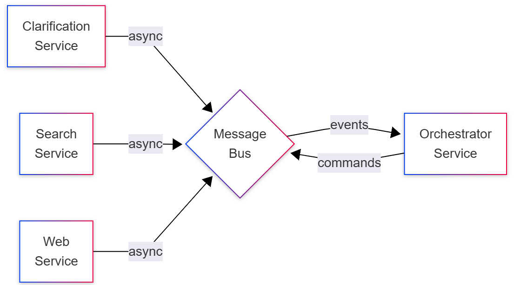
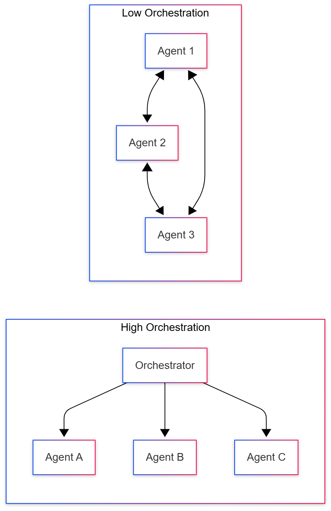
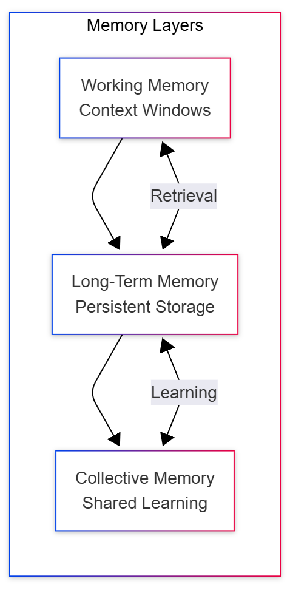
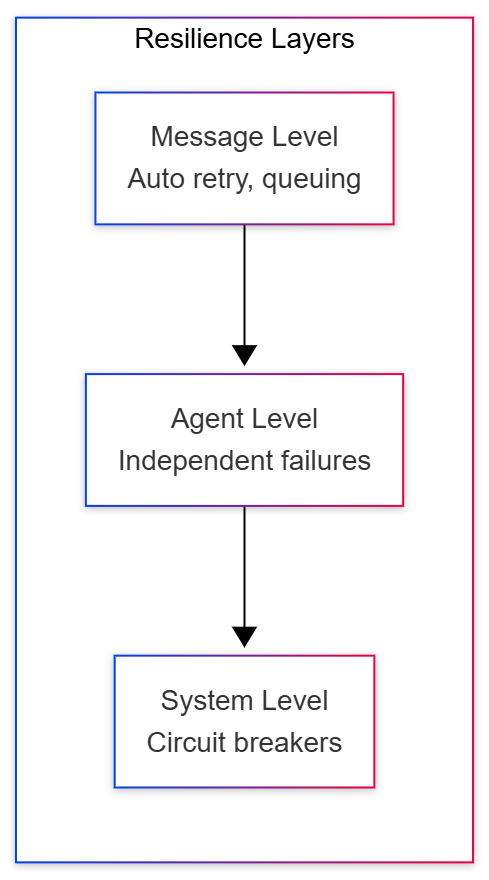
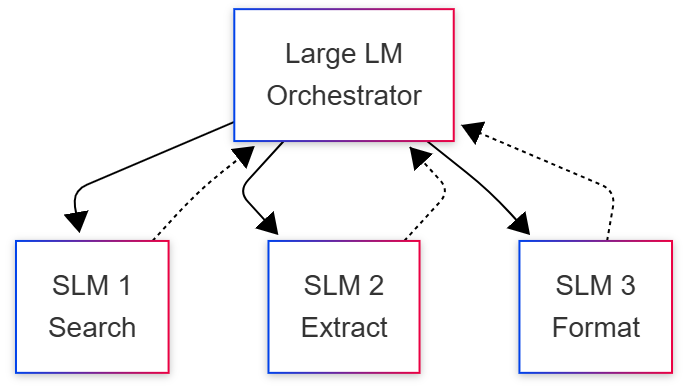
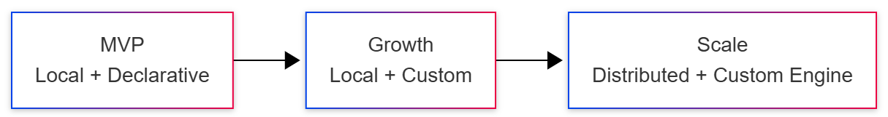

# Designing Multi-Agent Systems

Pitfalls and Challenges

Donald Thompson
Distinguished Engineer
Microsoft

---

## The Multi-Agent Landscape

### Current State of Multi-Agent Systems

- **Framework explosion**: LangGraph, CrewAI, OpenAI Agents SDK, AutoGen (2024)
- **Limited Production**: Most remain in PoC or pilot phase (LangChain State of AI Agents Report, 2024)
- **Deployment reality**: 67 agentic systems deployed by end of 2024 (MIT AI Agent Index)

Two running examples throughout: 
1. <strong>Academic Research Assistant</strong> - illustrating common pitfalls 
2. <strong>LinkedIn Hiring Assistant</strong> - lessons from production

---

## What We'll Cover Today

### Key Challenges in Multi-Agent Systems

- **Over-engineering**: When single agents suffice
- **Communication overhead**: Coordination exceeding benefits
- **State consistency**: Distributed consensus nightmares
- **Debugging complexity**: Emergent behaviors and cascading failures
- **Performance degradation**: Death by a thousand latencies
- **Agent sprawl**: The microservices antipattern redux

Plus: How LinkedIn solved these at scale

---

## What is an Agent?

An AI agent is an **autonomous** system powered by (language) models that **achieves goals** by:

- **Reasoning**: Using LLM capabilities for logical thinking
- **Planning**: Creating multi-step strategies
- **Acting**: Executing tools/APIs to effect change
- **Observing**: Monitoring outcomes and environment
- **Self-Correcting**: Adapting strategy based on feedback

Key differentiator: <strong>autonomy</strong> - agents maintain self-directed control over their process, dynamically adjusting their approach rather than following scripted paths.

---

## The Agent Cost Reality

### Example: Research Task Cost Comparison

**Single LLM Call Approach**:

- "Summarize latest SLM developments" → Response
- Cost: ~$0.02 (single GPT-4 call)
- Latency: 2-3 seconds

**Agent Workflow** (same task):

- Plan (2 calls) → Search (5 calls) → Synthesize (3 calls)
- Cost: ~$0.20-0.50 (**10-25x increase**)
- Latency: 15-30 seconds

Source: Lyzr.ai Agentic AI vs LLM analysis, 2025

---

## What is a Multi-Agent System?

A multi-agent system consists of two or more autonomous agents that **collaborate** (cooperative or adversarial) to achieve goals through:

- **Message passing** (distributed)
- **Direct invocation** (local)
- **Shared memory** (blackboard)
- **Environment modification** (state)

---

## Evolution to Multi-Agent

### Research Assistant → 3 Specialized Agents

**Why split?**

- Specialization of expertise
- Parallel execution capabilities
- Independent scaling and updates

---

## LinkedIn's Production Reality

### Supervisor Multi-Agent Pattern

- **AgentsOS**: Custom 4-layer platform infrastructure
- **Ambient agent pattern**: Async, non-blocking execution
- **Charter customer program**: Enterprise production deployment

---

## Why Not a Single Agent?

Almost everything marketed as "multi-agent" could be done with a single agent. Multi-agent is primarily a **software engineering** choice.

### What Single Agents Can Do

- Switch between different prompts/modes
- Call different models via tool use
- Manage complex workflows with state machines
- Handle "parallel" tasks through async operations

---

## When to Use Multi-Agent Systems?

### Hard Requirements (The Only True Needs)

- **Physical parallelism with latency constraints**
  Must process in multiple locations simultaneously

- **Regulatory/security boundaries**
  Different data access, compliance rules, or clearances

- **Organizational boundaries**
  Different teams/companies managing independently

---

## Why We Choose Multi-Agent Anyway

### Engineering Benefits

- **Team scalability** - Different teams own different agents
- **Deployment flexibility** - Update one agent independently
- **Prompt maintainability** - 50-line vs 500-line prompts
- **Testing isolation** - Test each agent independently
- **Failure boundaries** - Bugs don't cascade
- **Mental model clarity** - Easier to reason about

LinkedIn: 20+ teams building on shared platform

---

## Architecture Spectrum: Local

### Single Process, Shared Memory

- **Latency**: ~10-100ms
- **Examples**: LangGraph, CrewAI, SmolAgents, LlamaIndex
- **Use case**: Prototyping, small-scale deployments

---

## Architecture Spectrum: Distributed

### Network-Based Agent Communication

- **Latency**: ~100ms-1s per hop
- **Examples**: AutoGen (distributed mode), Ray, Temporal
- **LinkedIn AgentsOS**: Custom messaging infrastructure for agent coordination

---

## Architecture Spectrum: Declarative

### Low-Code/No-Code Agent Configuration

**Visual builders and configuration-driven development**

Agents defined through drag-and-drop interfaces, YAML/JSON configs, or simple prompt + tool specifications. No programming required.

- **Examples**: n8n, Copilot Studio, Flowise, Langflow
- **Trade-offs**: Fast to build, limited flexibility, harder to debug

---

## Architecture Spectrum: Custom Engine

### Code-First Agent Development

**Full programmatic control over agent behavior**

Agents implemented as code with complete control over reasoning, state management, tool invocation, and orchestration logic.

- **Examples**: LangGraph, CrewAI, AutoGen, OpenAI Agents SDK
- **Trade-offs**: Full control, steeper learning curve, more maintenance

---

## LinkedIn's AgentsOS Platform

### 4-Layer Architecture

1. **Orchestration Layer**
   Distributed execution, retry logic, traffic shifting

2. **Prompt Engineering Tools**
   Template management, versioning

3. **Skills and Tools Invocation**
   Centralized skill registry, API integration

4. **Content and Memory Management**
   Conversational memory, checkpointing

Python SDK with cross-language support

---

## Orchestration Patterns

### High vs Low Orchestration

---

## Emerging Orchestration Patterns

### Beyond Traditional Approaches

**Agents as Tools**:

- OpenAI SDK pattern: agents callable like functions
- Composable, reusable agent components

**Hybrid Declarative/Code**:

- Start declarative, extend with code
- Example: n8n with custom code nodes

**Model-Driven Orchestration**:

- LLM decides agent routing dynamically
- LinkedIn: Supervisor agent pattern

---

## Communication Protocols

### Modern Standards

- **A2A** (Google): 50+ partners, discovery-based
- **MCP** (Anthropic): Tool/resource interaction
- **LinkedIn**: Event-driven messaging infrastructure
  - Message persistence
  - Near-line recovery
  - Built on proven messaging platform (serves 1.2B+ LinkedIn users)

Foundation: FIPA-ACL, KQML standards

---

## Memory Architecture

### LinkedIn's 3-Tier System

---

## Memory Implementation

### Research Assistant vs LinkedIn

**Research Scenario**:

- Conversation history (working)
- Learned search patterns (long-term)
- PostgreSQL results, Redis sessions

**LinkedIn Production**:

- LLM context windows (working)
- Messaging infrastructure persistence (long-term)
- Cross-agent pattern learning (collective)
- Semantic search & summarization

---

## Implementation Challenges

### Communication Overhead

**Problem**: 3 agents × 5 rounds = 15 messages

**LinkedIn Solution**:

- Event-driven architecture
- Optimized message passing
- Batch operations where possible

> "When you're first trying to do something... you just throw everything at the wall... But the consequence is that you're not optimized at all"

---

## Implementation Challenges

### State Consistency

**Problem**: Race conditions in distributed updates

**LinkedIn Solution**:

- Message persistence
- Near-line recovery
- Checkpointing for resume

**Problem**: Debugging distributed systems

**LinkedIn Solution**:

- Analytics layer
- Replay capabilities
- Performance metrics

---

## Implementation Challenges

### Agent Sprawl & Performance

**Agent Sprawl Problem**:

- Do we need Citation Agent? Format Agent?
- Over-decomposition complexity

**LinkedIn Approach**: Centralized skill registry

**Performance Degradation**:

- Cascading latencies: 100ms + 500ms + 200ms

**LinkedIn Solution**:

- Re-engineered orchestration
- Intelligent caching
- Regional load balancing

---

## Fault Tolerance

### LinkedIn's Multi-Layer Resilience

Graceful degradation at every layer

---

## Emerging Trends: SLMs in Multi-Agent

### Small Language Models Revolution

**SLMs**: Models that fit on consumer devices (phone, laptop) with low-latency local inference for single-user agent tasks

- **10-30x cost reduction** for agent tasks
- **Edge deployment**: No network latency, full privacy
- **Agent suitability**: Most agent tasks need speed over sophistication

> "Small language models are sufficiently powerful, inherently more suitable, and necessarily more economical for many invocations in agentic systems"

- NVIDIA Position Paper

---

## Emerging Trends: Edge Deployment

### Local Agent Processing

> "A slim is a language model that can fit into a common consumer electronic device and perform inference with latency sufficiently low"

**Use Cases**:

- Privacy-sensitive processing
- Offline availability
- Ultra-low latency requirements

**Example**: Clarification Agent on device

---

## Emerging Trends: Hybrid Architectures

### Combining SLMs and LLMs

**Intelligent task routing between specialized models**

SLMs handle domain-specific and simple tasks locally with low latency, while LLMs tackle complex reasoning and open-ended queries.

**Semantic routing advances**: Embedding-based routers instantly direct queries to optimal models based on semantic similarity, not keywords.

---

## Emerging Trends: Hierarchical Reasoning

### HRM: 27M Parameters Outperforming Billions

**Hierarchical Reasoning Model** demonstrates architectural innovation over scale:

- **Two interdependent modules**:
  - High-level: Slow abstract planning and strategy
  - Low-level: Rapid detailed computations and execution

- **Remarkable efficiency**:
  - 40.3% on ARC benchmark (AGI test)
  - Only 1,000 training samples needed
  - Outperforms multi-billion parameter LLMs

**Implication for agents**: Future agents may use hierarchical architectures instead of monolithic LLMs

---

## Evolution Path

### From MVP to Scale

---

## Key Decisions & Action Plan

### Architecture Choices

**Single vs Multi-Agent**: Start single, split only for parallelism/boundaries
**Local vs Distributed**: Prototype local, distribute when scaling demands
**Declarative vs Custom**: Begin declarative, go custom for control
**LLMs vs SLMs**: Use SLMs for speed/cost, LLMs for complex reasoning

### Production Readiness

**Protocols**: Adopt standards (A2A, MCP) for interoperability
**Evals**: Build agent-specific benchmarks before deployment
**Operations**: Invest in debugging, observability, replay capabilities
**Cost Controls**: Monitor token usage, implement semantic routing

---

## Resources & References

### Key Papers & Documentation

- **LinkedIn Hiring Assistant**: [Engineering Blog](https://www.linkedin.com/blog/engineering/generative-ai/the-tech-behind-the-first-agent-from-linkedin-hiring-assistant)
- **NVIDIA SLMs Paper**: "Small Language Models are the Future of Agentic AI" (arXiv:2506.02153)
- **HRM Paper**: "Hierarchical Reasoning Model" (arXiv:2506.21734)
- **LangChain State of AI Agents**: [2024 Report](https://www.langchain.com/stateofaiagents)

### Frameworks & Tools

- **A2A Protocol**: [Google's Agent-to-Agent](https://github.com/google/agent-to-agent)
- **MCP**: [Anthropic Model Context Protocol](https://github.com/anthropics/model-context-protocol)
- **LangGraph**: [Graph-based orchestration](https://github.com/langchain-ai/langgraph)
- **CrewAI**: [Role-based agents](https://github.com/joaomdmoura/crewAI)

### Production Resources

- **MIT AI Agent Index**: [67 deployed systems](https://aiagentindex.mit.edu)
- **Lyzr.ai Cost Analysis**: [Agentic AI vs LLM](https://www.lyzr.ai/blog/agentic-ai-vs-llm/)
- **Semantic Router**: [Aurelio AI Docs](https://docs.aurelio.ai/semantic-router)
